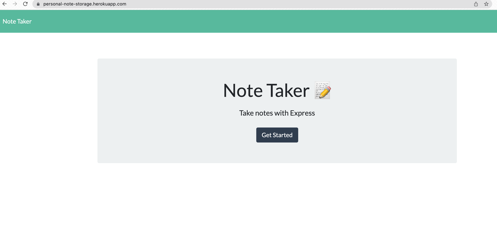
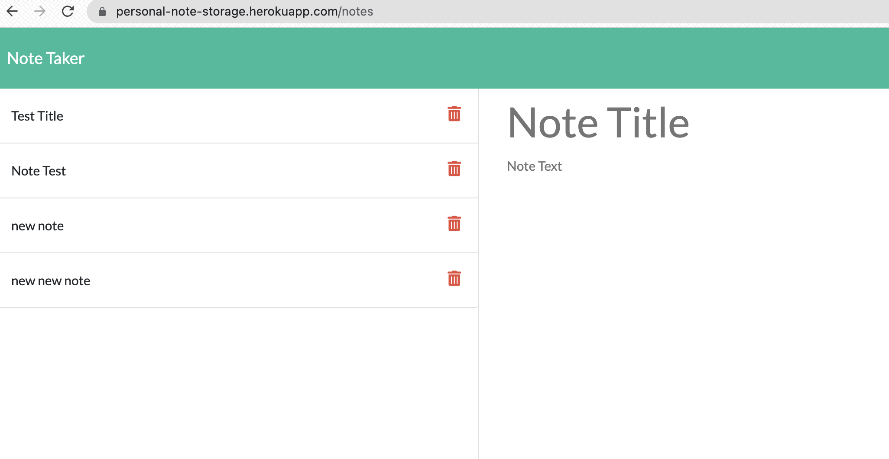

# Note_Taking_Application
## Description

The goal of this was to build the backend for a web application that allows the user to create notes, save them, open old notes, and delete notes. It utalizes the get, post, and delete methods for express.js creating custom routes.

## Table of Contents

-[Installation](#installation)  
-[Usage](#usage)  
-[Contributing](#contributing)  
-[Tests](#tests)  
-[Questions](#questions)  
-[License](#license)  

## Installation

The following is required to install the program.  
npm i

## Usage
To run, do the following:   
The application can be used on the web at the [deployed application](https://personal-note-storage.herokuapp.com/)

Usage Images:

  
  

## Contributing

please fork

## Tests

none

## Questions

For questions please check [my GitHub](https://github.com/Tward9)
or reach out via email at <theoward9@gmail.com>
